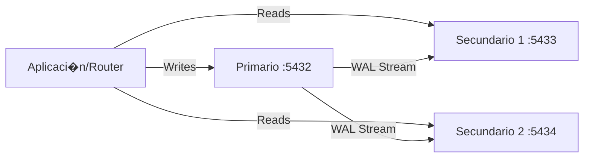

# EcoMarket: Distribuci�n de Datos - Replicaci�n y Sharding

##  Objetivo de la Semana
Evolucionar la arquitectura de base de datos de EcoMarket desde una instancia monol�tica hacia un cl�ster distribuido. Aprender�s a implementar **Replicaci�n** para escalar lecturas y **Sharding** para escalar escrituras, comprendiendo los trade-offs del Teorema CAP.

---

##  Arquitectura Implementada

### 1. Replicaci�n (Escalamiento de Lecturas)
Implementamos un modelo **Primario-Secundario** con PostgreSQL:
- **Primario (Puerto 5432):** Recibe todas las escrituras (`INSERT`, `UPDATE`, `DELETE`).
- **Secundarios (Puertos 5433, 5434):** Reciben copias de datos v�a *Streaming Replication* y sirven lecturas (`SELECT`).



### 2. Sharding (Escalamiento de Escrituras)
Distribuimos los datos de usuarios entre m�ltiples nodos usando dos estrategias de particionamiento:
- **Hash Simple:** `shard = hash(user_id) % num_shards` (F�cil, pero alto costo de rebalanceo).
- **Consistent Hashing:** Minimiza el movimiento de datos al agregar/quitar nodos (usado en producci�n).

---

##  Gu�a de Inicio R�pido

### Prerrequisitos
- Docker y Docker Compose
- Python 3.9+
- Librer�a `psycopg2-binary` (`pip install psycopg2-binary`)

### Paso 1: Levantar la Infraestructura
El archivo `docker-compose.yml` levanta un cl�ster PostgreSQL con replicaci�n configurada autom�ticamente.

```bash
# En la carpeta Semana7
docker-compose up -d --build
```

> **Nota:** Aseg�rate de que los puertos 5432-5436 est�n libres.

### Paso 2: Verificar Replicaci�n
Con�ctate al primario y verifica que las r�plicas est�n conectadas:

```bash
docker exec -it ecomarket-db-primary psql -U postgres -d ecomarket -c "SELECT * FROM pg_stat_replication;"
```
Deber�as ver dos filas con estado `streaming`.

### Paso 3: Ejecutar Pruebas de Carga y Sharding
El script `load_test.py` ejecuta una suite completa de pruebas:
1. **Writes al Primario:** Mide throughput de escritura.
2. **Reads Distribuidos:** Verifica balanceo de carga entre secundarios.
3. **Lag de Replicaci�n:** Mide el retraso en milisegundos.
4. **Failover:** Simula la ca�da de un nodo.
5. **Sharding:** Compara Hash Simple vs Consistent Hashing y valida distribuci�n de datos.

```bash
python load_test.py
```

---

##  Estructura del Proyecto

| Archivo | Descripci�n |
|---------|-------------|
| `semana_7.html` | **Gua Principal:** Teora detallada, diagramas y paso a paso del taller. |
| `shard_router.py` | **Core:** Implementacin de las clases `SimpleHashShardRouter` y `ConsistentHashRouter`. |
| `load_test.py` | **Test Suite:** Script para validar replicacin, medir lag y probar sharding. |
| `stress_test_single_db.py` | **Test:** Prueba de estrés para base de datos única. |
| `events.py` | **Core:** Definición de eventos del sistema. |
| `users_service.py` | **Service:** Servicio de gestión de usuarios. |
| `docker/` | Configuracin de contenedores y scripts de inicializacin de BD (`init-primary.sh`). |

---

##  Conceptos Clave

### Replicaci�n vs Sharding
| Caracter�stica | Replicaci�n | Sharding |
|----------------|-------------|----------|
| **Objetivo** | Alta Disponibilidad, Escalar Reads | Escalar Writes, Almacenamiento Infinito |
| **Datos** | Copia completa en cada nodo | Datos divididos (particionados) |
| **Complejidad**| Media | Alta (Routing, Rebalanceo) |

### Teorema CAP en EcoMarket
- **Inventario:** Priorizamos **Consistencia (CP)** para no vender productos sin stock.
- **Carrito/Recomendaciones:** Priorizamos **Disponibilidad (AP)** para mejor experiencia de usuario.

---

##  Resultados Esperados

```text
 REPLICACI�N:
  Writes/s primario: 450.2
  Reads/s secundarios: 1200.5
  Factor de escalamiento: 2.6x

 SHARDING:
  Balance de distribuci�n: 98.5% (Excelente)
  Consistent Hashing: Reduce rebalanceo de 67% a 33%
```

##  Tarea / Entregable
1. Ejecutar la simulaci�n completa.
2. Analizar los logs para ver el comportamiento del `ConsistentHashRouter`.
3. Responder las preguntas de reflexi�n en `semana_7.html`.
4. Video corto demostrativo https://drive.google.com/file/d/1UGsgYSxE2j80FfzPTLJ9OKKqXQORDjNO/view.