 Actividad Integradora: Flujo E2E Seguro
Este documento detalla el flujo completo de seguridad End-to-End (E2E) implementado en EcoMarket, integrando HTTPS (TLS), Autenticación JWT y Gestión de Secretos.

1. Diagrama de Secuencia del Flujo Seguro

```mermaid
sequenceDiagram
    participant Cliente as 🖥️ Cliente (Browser)
    participant Nginx as 🔒 Nginx (Gateway)
    participant Auth as 🔐 Auth Service
    participant Central as 📦 Central API
    participant Env as 🔑 .env (Secretos)
    participant DB as 💾 Base de Datos

    Note over Cliente,DB: 🔐 FLUJO DE LOGIN (HTTPS/TLS 1.3)
    
    rect rgb(40, 40, 60)
        Note right of Cliente: POST /api/auth/login<br/>(Credenciales Cifradas)
        Cliente->>+Nginx: Canal Seguro (HTTPS/TLS 1.3)
        Note right of Nginx: Forward (HTTP Interno)
        Nginx->>+Auth: POST /login {username, password}
        
        Auth->>+DB: SELECT user WHERE username=...
        DB-->>-Auth: Hash del Password
        
        Note over Auth: Verificar Hash (bcrypt)
        
        Auth->>+Env: Leer JWT_SECRET
        Env-->>-Auth: "super-secreto-seguro"
        
        Note over Auth: Firmar Token (HS256)
        Auth-->>-Nginx: 200 OK {token: "eyJ..."}
        Note right of Nginx: 200 OK Token "eyJ...3 (Cifrado TLS)
        Nginx-->>-Cliente: 200 OK (Datos Cifrados)
    end

    Note over Cliente,DB: 🛡️ FLUJO DE ACCESO A RECURSOS PROTEGIDOS

    rect rgb(40, 60, 40)
        Note right of Cliente: GET /products<br/>(Header: Bearer eyJ...)
        Cliente->>+Nginx: Canal Seguro (HTTPS/TLS 1.3)
        Note right of Nginx: Forward (HTTP Interno)
        Nginx->>+Central: GET /products<br/>Authorization: Bearer eyJ...
        
        Central->>+Env: Leer JWT_SECRET
        Env-->>-Central: "super-secreto-seguro"
        
        Note over Central: Verificar Firma y Expiración
        
        Central->>+DB: SELECT * FROM products
        DB-->>-Central: JSON [Productos]
        
        Central-->>-Nginx: 200 OK (Datos Cifrados)
        Note right of Nginx: 200 OK (Datos Cifrados)
        Nginx-->>-Cliente: 200 OK [Productos]
    end

    Note over Cliente,DB: ✅ Comunicación E2E Segura:<br/>HTTPS + JWT + Secrets Management
```

### Componentes del Diagrama

| Componente | Función | Tecnología |
|-----------|---------|------------|
| **Cliente (Browser)** | Interfaz de usuario | HTML/CSS/JavaScript |
| **Nginx (Gateway)** | Terminación TLS/SSL | Nginx con certificados SSL |
| **Auth Service** | Autenticación y generación JWT | FastAPI + PyJWT |
| **Central API** | Recursos protegidos | FastAPI + Middleware JWT |
| **.env (Secretos)** | Gestión de configuración | Variables de entorno |
| **Base de Datos** | Almacenamiento persistente | PostgreSQL/MySQL |

### Flujo de Seguridad

#### 🔐 Fase 1: Autenticación (Login)
1. **Cliente → Nginx**: Petición HTTPS cifrada con TLS 1.3
2. **Nginx → Auth Service**: Forward interno (HTTP)
3. **Auth → DB**: Validación de credenciales (bcrypt)
4. **Auth → .env**: Lectura del `JWT_SECRET`
5. **Auth → Cliente**: Token JWT firmado (HS256) vía HTTPS

#### 🛡️ Fase 2: Autorización (Acceso a Recursos)
1. **Cliente → Nginx**: GET con header `Authorization: Bearer <token>`
2. **Nginx → Central API**: Forward con token
3. **Central → .env**: Lectura del `JWT_SECRET` para verificación
4. **Central**: Validación de firma y expiración del token
5. **Central → DB**: Query a recursos si token válido
6. **Central → Cliente**: Respuesta cifrada con HTTPS

2. Descripción Detallada del Flujo
POST /login vía HTTPS:
El cliente envía username y password.
Wireshark: Solo vería "Application Data" cifrado (TLS 1.2/1.3). Un atacante en la red Wi-Fi no puede leer las credenciales.
Validación de Credenciales:
El servicio de autenticación recibe la petición (desencriptada por Nginx).
Consulta la base de datos para validar el usuario.
Firma de JWT:
Si las credenciales son válidas, el servicio genera un JWT.
Clave: Usa la variable JWT_SECRET cargada desde el archivo .env (nunca hardcodeada en el código).
Retorno del Token:
El token viaja de regreso al cliente a través del túnel HTTPS establecido por Nginx.
Acceso a Recurso Protegido (GET /products):
El cliente almacena el token (ej. LocalStorage) y lo adjunta en el header Authorization: Bearer <token>.
La petición viaja cifrada nuevamente.
Validación del Middleware:
El servicio Central API intercepta la petición.
Usa el mismo JWT_SECRET del .env para verificar que la firma del token sea válida y que no haya expirado.
Respuesta Segura:
Si el token es válido, la API procesa la solicitud y devuelve los datos.
Nginx cifra la respuesta antes de enviarla al cliente.
3. Análisis de Seguridad
¿Qué protege HTTPS?
Objetivo: Confidencialidad e Integridad de los datos en tránsito.
Mecanismo: Cifrado asimétrico (Handshake) + Simétrico (Data) usando TLS.
¿Qué pasa si falla?
Ataque: Man-in-the-Middle (MitM).
Consecuencia: Un atacante puede leer contraseñas, robar tokens de sesión y ver datos sensibles de los usuarios.
¿Qué protege JWT?
Objetivo: Identidad (Autenticación) y Permisos (Autorización) de forma "Stateless".
Mecanismo: Firma digital (HMAC SHA256) que garantiza que el token no ha sido modificado.
¿Qué pasa si falla?
Fuga: Si un atacante roba el token, puede suplantar al usuario (Impersonation) hasta que el token expire.
Debilidad: Si se usa un algoritmo débil ("none") o una firma inválida no se chequea, se puede falsificar la identidad.
¿Qué protege el .env?
Objetivo: Seguridad de la Configuración y Secretos.
Mecanismo: Separación de código y configuración (12-Factor App). El archivo .env no se sube al control de versiones (.gitignore).
¿Qué pasa si falla?
Exposición: Si se sube a GitHub, cualquiera puede ver el JWT_SECRET o la contraseña de la base de datos.
Consecuencia: Con el JWT_SECRET, un atacante puede generar sus propios tokens de "Admin" y tomar control total del sistema.
